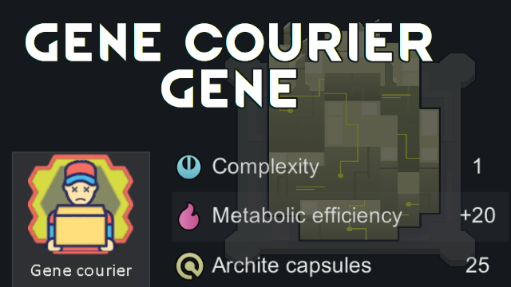

# Gene Courier Gene

Allows you to carry all your precious carefully collected genes to the next Archonexus map by implanting them into a pawn.

The patient will be in a xenogermination coma for 2-4 weeks, and then their body will explode, returning back all the genepacks implanted.
Will not spawn anything if killed violently or died of natural causes.

Complexity: +1
Metabolic efficiency: +20
Archite capsules: 25

Safe to add/remove mid-game. Pawn will lose the Gene Courier gene on removal.

## Recommended mods

- [Archite Capsule Extractor](https://steamcommunity.com/sharedfiles/filedetails/?id=2959446434)
- [Oops All Gene Banks](https://steamcommunity.com/sharedfiles/filedetails/?id=2883683444)
- [Gene Extractor Weights](https://steamcommunity.com/sharedfiles/filedetails/?id=2883796262)
- [More Gene Information](https://steamcommunity.com/sharedfiles/filedetails/?id=2942759212)
- [Random's Gene Assistant](https://steamcommunity.com/sharedfiles/filedetails/?id=2882497271)
- [Alpha Genes](https://steamcommunity.com/sharedfiles/filedetails/?id=2891845502)
- [WVC - Xenotypes and Genes](https://steamcommunity.com/sharedfiles/filedetails/?id=2886992038)

## You may also like...

https://github.com/zed-0xff/RW-GeneCourier

## Support me

 or [Patreon](https://www.patreon.com/zed_0xff)
